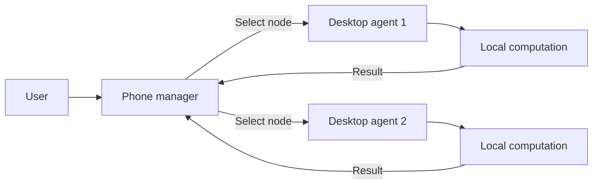
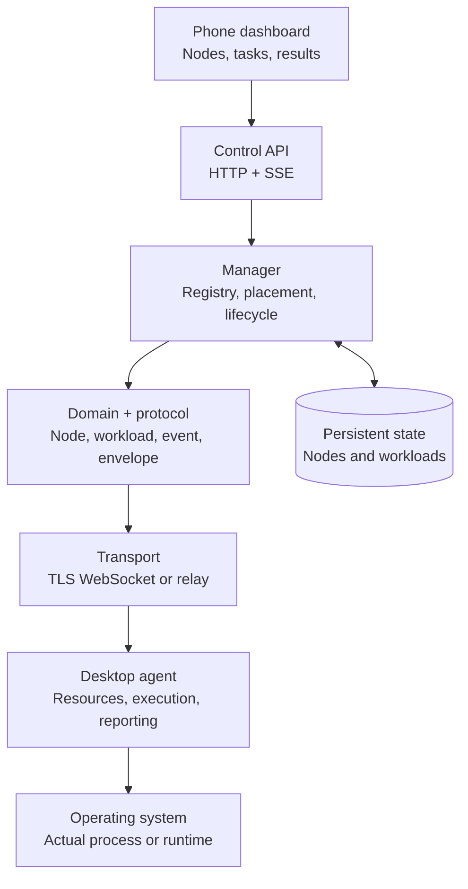
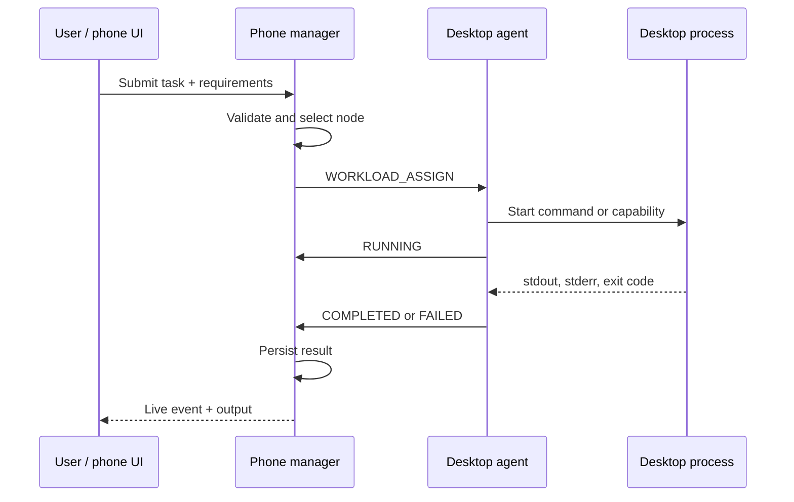
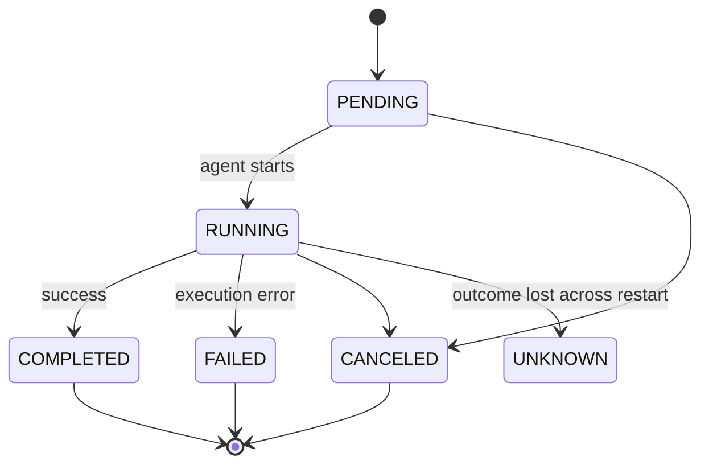
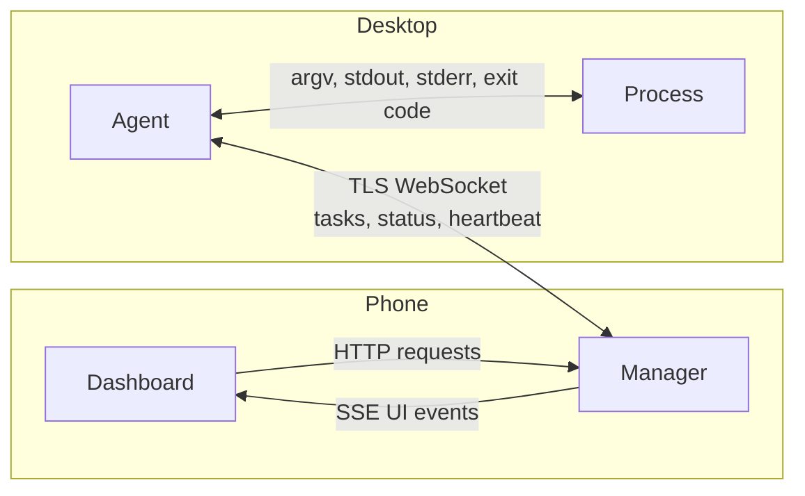
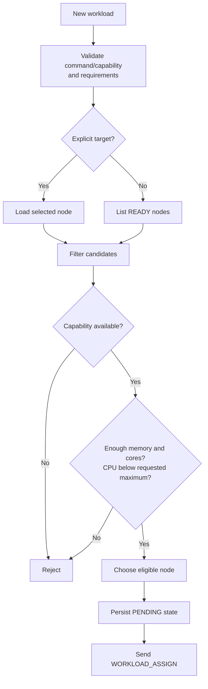
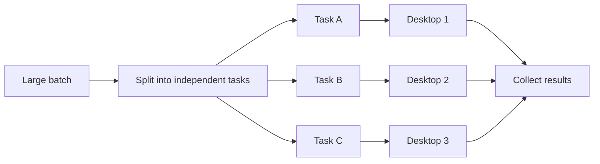
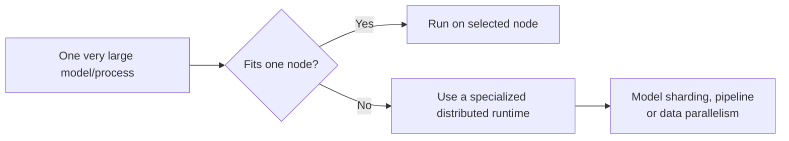
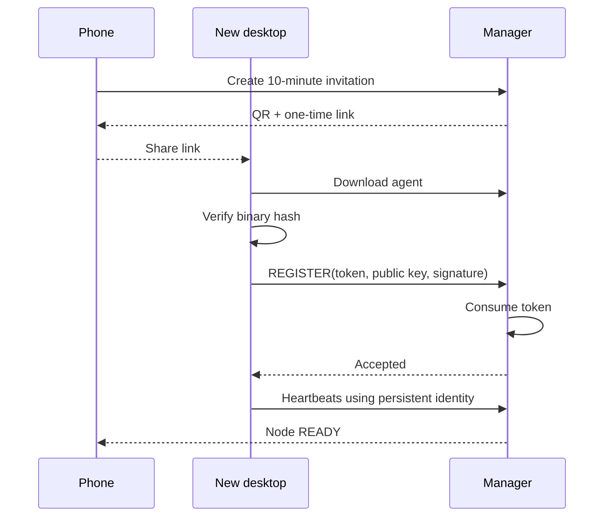
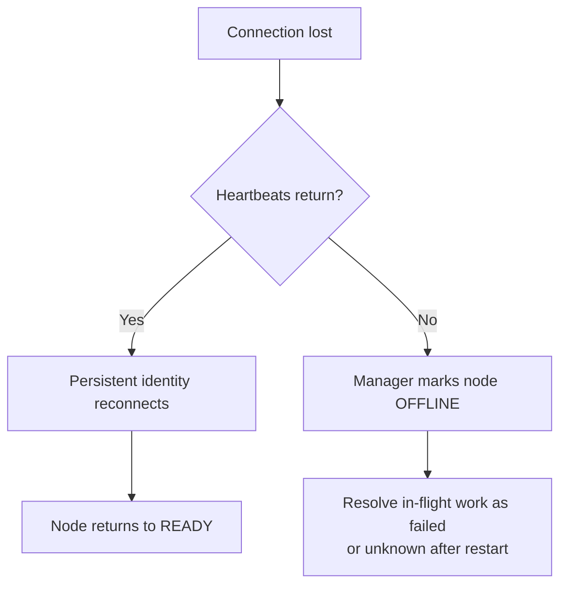

# Home Compute Harness — Visual Workflow Guide

## What it does

The Android phone coordinates work. Connected computers supply the CPU, memory, and specialized runtimes.



> The phone makes decisions; the selected desktop performs the computation.

## System layers



| Layer | Responsibility |
|---|---|
| Dashboard | Request work and observe the system |
| Manager | Decide where work should run |
| Scheduler | Match requirements to a READY node |
| Protocol | Define structured messages |
| Transport | Deliver messages securely |
| Agent | Control work on a remote device |
| OS/runtime | Perform the computation |
| Persistence | Retain identities, states, and results |

## Complete task workflow





## Communication channels



- **TLS WebSocket:** registration, heartbeats, tasks, cancellation, and results.
- **HTTP:** dashboard actions such as creating and inspecting workloads.
- **SSE:** live manager events sent to the dashboard; it does not carry desktop tasks.
- **Relay:** optional off-LAN carrier; manager TLS remains end to end.

## How tasks are distributed

Each workload may name a specific node or allow automatic placement.



Current behavior:

- An explicit target stays pinned to that node.
- With no target, the manager chooses an eligible READY node.
- Capability and resource requirements are hard eligibility checks.
- One workload currently runs wholly on one selected node.
- A restart policy may resubmit eligible failed work with backoff.
- Resource checks do not yet reserve capacity, so simultaneous placements can oversubscribe a node.

### Scaling independent work



Good fits: image batches, document partitions, builds, tests, embeddings, evaluations, and independent LLM prompts.

### What is not automatic



The harness can start and coordinate a distributed runtime, but that runtime must split the computation and exchange its data.

## Device enrollment



The invitation is used only for first admission. Reconnects authenticate with the device’s persistent cryptographic identity.

## Edge cases and current handling

| Edge case | Current behavior |
|---|---|
| No READY node | Workload is rejected instead of waiting indefinitely |
| Insufficient memory/cores | Candidate is excluded; request fails if none qualify |
| Required capability missing | Node is excluded from placement |
| Explicit target offline | Request is rejected; it is not silently moved elsewhere |
| Agent loses connection | Heartbeat expiry marks it OFFLINE and in-flight work is failed |
| Agent reconnects | Persistent identity restores the known node without reusing enrollment |
| Manager restarts during work | Persisted in-flight status becomes `UNKNOWN` when the real outcome cannot be proven |
| User cancels running work | Manager sends cancellation; agent terminates the local workload |
| Process exits non-zero | Workload becomes FAILED with stderr, exit code, and error context |
| Excessive output | Captured stdout/stderr is capped at 64 KiB and marked truncated |
| Wrong OS agent binary | QR enrollment rejects the platform mismatch |
| Expired/reused invitation | Enrollment returns not found and cannot admit another identity |
| Phone Wi-Fi IP changes | LAN agents rediscover the manager; networks that block multicast still need a stable address or relay |
| Duplicate agent identities | They appear as separate nodes and may overstate physical capacity; host deduplication is not implemented yet |
| Two tasks select the same free resources | Capacity is not reserved yet, so oversubscription is possible |
| Relay becomes unavailable | Agent reconnect loop uses exponential backoff; LAN path remains independent when configured |
| Manager certificate changes | Pinned clients reject it until the new fingerprint is explicitly trusted |
| Insecure agent mode | Agent refuses workload execution to avoid arbitrary code from an unauthenticated manager |

## Failure and recovery



## Compact mental model

```text
Phone             = coordinator
Manager           = decision maker
Scheduler         = node selector
TLS WebSocket     = secure task/result channel
Agent             = worker controller
Desktop process   = actual computation
SSE               = live dashboard notification
Persistent store  = history and recovery
```
