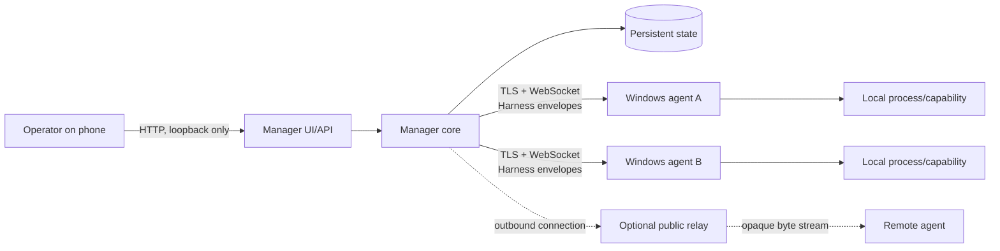
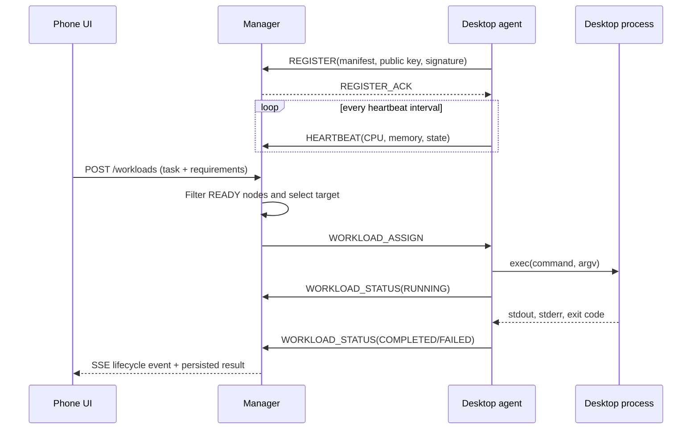
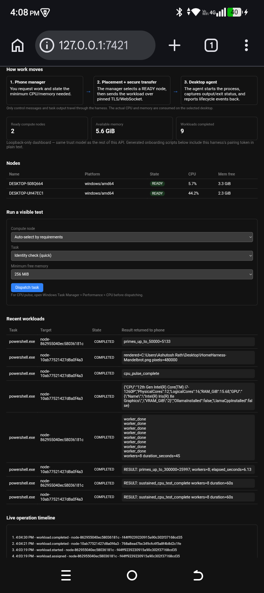
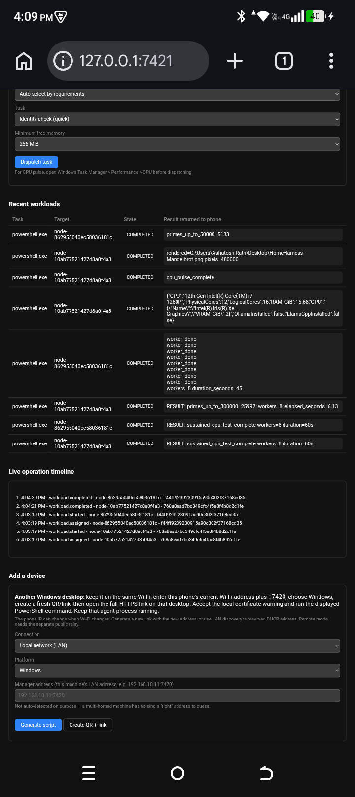

# Home Compute Harness

## Architecture and Solution Brief for Senior Software / Solutions Engineers

**Status:** working hardware prototype  
**Validated topology:** Android 15 phone running Termux as control plane; two Windows/amd64 agent identities; LAN and relay transport implementations  
**Last live validation:** 14 September 2026

## 1. Executive summary

Home Compute Harness turns personally owned, heterogeneous devices into a small private compute fabric. An Android phone can act as the always-available control plane: it enrolls desktops by QR/link, maintains device identity and health, selects an eligible node for work, dispatches a task, and records the returned result.

The current prototype has proven the complete control loop on real hardware:

- phone-hosted manager and browser UI;
- one-time Windows enrollment over HTTPS;
- persistent cryptographic node identity;
- continuous CPU/memory heartbeats;
- resource-aware placement;
- remote process execution and cancellation;
- captured stdout, stderr, exit code, and timestamps;
- workload history surviving manager restart;
- simultaneous 60-second compute tasks on two registered Windows nodes;
- direct LAN and outbound-only public-relay connectivity.

The product direction is not “another Kubernetes.” It is a low-friction, phone-first control plane for spare personal compute where devices and transports can vary, onboarding must work for a non-operator, and useful execution should not require a container platform.

## 2. What problem are we solving?

People often have unused CPU, memory, storage, or accelerators spread across laptops, desktops, and phones. Using them together normally requires installing and operating infrastructure designed for servers, writing framework-specific programs, or trusting an external cloud/control plane.

The harness provides a smaller abstraction:

> Describe a task, its capability, and its resource requirements; let the phone select an authorized device; receive a durable result.

Immediate use cases include batch image processing, document partitioning, compilation/test matrices, media conversion, file analysis, embeddings, evaluation batches, and routing independent LLM requests to machines that already host a suitable model.

It does **not** yet combine several computers into one shared-memory machine. A single process runs on one selected node. Model/tensor sharding requires a specialized runtime beneath the harness.

## 3. System context

The phone coordinates; execution consumes CPU/RAM on the selected desktop. Normal workload control and textual results move through the manager. Bulk datasets and model files should ultimately move directly or be pre-positioned rather than being forced through the control plane.

## 4. Architecture layers

| Layer | Responsibility | Current implementation |
|---|---|---|
| Experience | Enrollment, capacity, task dispatch, results, event visibility | Self-contained phone dashboard and `harnessctl` |
| Control API | Operator-facing commands and queries | Loopback HTTP API; SSE event stream for UI refresh |
| Orchestration | Registry, eligibility, placement, lifecycle, reconciliation | Manager server, resource-aware scheduler, workload registry |
| Domain | Stable platform-neutral vocabulary | Node, Manifest, Resource, Capability, Workload, Event, Transport |
| Protocol | Typed request/status messages and correlation | JSON Harness envelopes over an abstract connection |
| Transport | Ordered bidirectional delivery | TLS WebSocket on LAN; rendezvous relay off-LAN; multi-transport fan-in |
| Trust | Manager authentication, node identity, first admission | ECDSA manager certificate pinning; Ed25519 node identity; one-time token |
| Execution | Convert an authorized workload into local work | Agent capability dispatch; direct argv execution; bounded output capture |
| Persistence | Survive control-plane restart | BoltDB node/workload records; persistent TLS and node keys |

The primary architectural constraint is that domain, manager, and agent logic depend on `Transport` and other domain contracts—not on Android, Windows, WebSocket, or relay packages. OS and carrier decisions remain at adapters and composition roots.

## 5. Communication and task transfer

### 5.1 Connection establishment

1. The agent dials the phone; the manager does not require inbound access to the desktop.
2. On LAN, the carrier is a WebSocket secured by TLS.
3. The agent pins the manager certificate SHA-256 fingerprint. This is server-authenticated TLS, not conventional mutual TLS.
4. The agent sends `REGISTER` with its manifest, NodeID/public key, admission token, and Ed25519 signature.
5. The manager checks first-admission authorization and proof of private-key possession.
6. Later reconnects use the persistent node identity and do not reuse the one-time enrollment token.

For off-LAN devices, manager and agent both dial a rendezvous relay. The private relay path pairs connections and copies bytes; end-to-end manager TLS remains the trust boundary. The public enrollment gateway is a separate browser-trusted HTTPS surface with token-scoped paths.

### 5.2 Runtime message flow

Workloads are structured (`command`, ordered `args`, capability, requirements, target/restart policy). The agent does not interpret them as an untrusted shell string. Captured output is capped at 64 KiB to bound agent memory, protocol payload, and persistent-state growth.

### 5.3 Where SSE fits

Server-Sent Events are used only from the manager’s loopback HTTP API to the phone dashboard. They push lifecycle notifications such as `node.ready`, `workload.assigned`, `workload.started`, and `workload.completed`. SSE is **not** the manager-agent task transport; TLS WebSocket carries that traffic.

## 6. Live system evidence

### Phone control plane and capacity view

This live screenshot shows two READY Windows identities, reported CPU/free memory, completed tasks, returned results, and the manager event timeline. It also exposes a prototype limitation: identities are counted independently, so duplicate agents on one physical host can temporarily overstate capacity until physical-host deduplication is added.

### Task result, lifecycle timeline, and onboarding

Hardware demonstrations completed through this path include:

| Test | Placement | Observed result |
|---|---|---|
| Prime calculation | Explicit Windows node | 5,133 primes through 50,000; exit 0 |
| Resource-aware identity task | Automatic | Manager chose an eligible node and returned its hostname |
| Image render | Explicit Windows node | 480,000-pixel Mandelbrot PNG; exit 0 |
| Parallel prime calculation | 8-worker requirement | 25,997 primes through 300,000 in 6.13 seconds |
| Sustained compute | Two nodes concurrently | 8 workers/node for 60 seconds; approximately 52–75% reported CPU; both exit 0 |

## 7. Adding another desktop

For a desktop on the same Wi-Fi:

1. Keep the Termux manager running and open `http://127.0.0.1:7421` on the phone.
2. Determine the phone’s current Wi-Fi IP and enter `<phone-ip>:7420` in **Add a device**.
3. Select **LAN** and **Windows**, then create a fresh QR/link.
4. Open the complete `https://<phone-ip>:7420/enroll/<one-time-token>` link on the new desktop.
5. Accept the expected local self-signed-certificate warning and run the displayed PowerShell bootstrap.
6. The installed per-user launcher keeps retrying and starts again at logon; the dashboard changes to READY after registration/heartbeats.

Current operational caveats:

- the invitation expires after ten minutes and is consumed by first successful registration;
- the manager currently serves one agent-binary platform at a time;
- LAN agents rediscover the manager after its Wi-Fi IP changes, but multicast can still be blocked by some networks;
- launchers are per-user startup mechanisms rather than OS-level supervised services; Android OEM battery policy can still stop Termux;
- the loopback operator API is fully privileged and must not be exposed directly to the LAN.

## 8. Similar systems and differentiation

| System | What it already does well | Difference from this harness |
|---|---|---|
| [Kubernetes](https://kubernetes.io/docs/concepts/architecture/) | Mature control plane for scheduling containerized workloads across nodes | Container/platform operations first; substantially heavier. This harness targets personal heterogeneous devices, direct capabilities/processes, phone-first enrollment, and a minimal private control plane. |
| [Ray](https://docs.ray.io/en/latest/ray-core/key-concepts.html) | Distributed tasks, actors, objects, and logical resource requests | Developer/framework-centric and strongest for Ray applications. This harness aims to coordinate device capabilities without requiring every task to be rewritten as a Ray program. Ray could later be launched as a managed capability. |
| [BOINC](https://boinc.berkeley.edu/boinc_a_platform_for_volunteer_computing.pdf) | Large-scale volunteer/batch computing with HTTP-based project infrastructure | Project/server-centric volunteer science. This harness is owner-controlled, interactive, identity-aware, and intended for a small private fleet with arbitrary capabilities. |
| [Petals research](https://papers.neurips.cc/paper_files/paper/2023/file/28bf1419b9a1f908c15f6195f58cb865-Paper-Conference.pdf) | Splits large-model blocks across unreliable, geographically distributed peers | LLM/model-parallelism-specific. The harness is a general control plane and currently schedules a whole task to one node; Petals-like sharding would be an execution runtime beneath it. |
| [llama.cpp RPC](https://github.com/ggerganov/llama.cpp/discussions/11440) | Can offload model computation to RPC servers for multi-node inference | Provides the inference engine, not device enrollment, general workload lifecycle, policy, or phone operations. It is a plausible future `llm.generate`/distributed-inference adapter. |

The differentiation is the combination, not a claim that scheduling or distributed inference is new:

- phone-first ownership and operation;
- QR/link admission without embedding permanent secrets;
- persistent per-device cryptographic identity;
- transport-neutral manager/agent core;
- LAN plus outbound relay without making a third-party cloud the trust boundary;
- heterogeneous capability model rather than container-only execution;
- resource-aware dispatch plus durable, human-visible results;
- intentionally small operational footprint for a personal fleet.

## 9. LLM workload interpretation

An LLM task should become a named capability such as `llm.generate`, not an arbitrary shell command. A node manifest would advertise runtime, available models, context limits, accelerator/VRAM, and concurrency. The manager would place a request only on a compatible node and stream generation events/results to the phone.

There are two distinct scaling modes:

1. **Request parallelism:** route independent prompts, document shards, embeddings, or evaluations to different nodes. The current architecture can evolve into this directly.
2. **Model parallelism:** split one model/inference across several nodes. This is not ordinary scheduler aggregation; it requires an engine such as llama.cpp RPC or a Petals-like pipeline, model placement, topology awareness, high-bandwidth transfer, and failure semantics.

The validated Windows desktop (i7-1260P, 15.68 GiB RAM, integrated Iris Xe) is suitable for small quantized models after installing an inference runtime, but not for a large 30B–70B model by itself. The manager should treat model presence and VRAM as explicit capabilities/resources rather than infer them from CPU/RAM alone.

## 10. Engineering assessment

### Strengths already demonstrated

- Architectural separation has held through LAN, relay, QR onboarding, self-update, capabilities, and phone deployment.
- Trust is layered: manager pinning, node proof-of-possession, and separate first-admission authorization.
- Workload state is explicit and observable rather than “fire and forget.”
- Real Android/Windows testing has already exposed and corrected OS-specific failures that unit tests would miss.

### Material gaps before production

- Replace arbitrary process execution as the primary UX with allow-listed, versioned capabilities and policy.
- Install both manager and agents as durable supervised services.
- Add node revocation, credential rotation, operator authentication, and audit retention.
- Deduplicate physical hosts and implement reservation/accounting so concurrent placements do not oversubscribe reported resources.
- Add artifact/data transfer with integrity, quotas, locality, and lifecycle management.
- Add multi-platform binary catalog and signed release/update metadata.
- Improve stable discovery/addressing and finish public-relay operational packaging.
- Define delivery semantics, idempotency, retries, and reconciliation for manager/agent/network failure combinations.
- Add LLM-runtime adapters only after model inventory, data movement, isolation, and policy boundaries are explicit.

## 11. Recommended next increments

1. **Operational reliability:** Termux:Boot, wake lock/battery guidance, Windows service installation, stable address/discovery.
2. **Trust administration:** node list with revoke/rename, operator authentication, duplicate-host warning, audit log.
3. **Safe capability UX:** replace raw commands in the dashboard with typed tasks, schemas, input validation, and per-capability policy.
4. **Artifacts:** content-addressed inputs/results with hashes, size limits, direct transfer, and visible provenance.
5. **LLM vertical slice:** `llm.inventory` and `llm.generate` against one local runtime; model-aware placement; token/result UI; cancellation and concurrency limits.
6. **Scale-out:** request-level fan-out/fan-in first; specialized model sharding only where measurements justify its network and reliability cost.

## 12. Code map for technical review

- `internal/domain`: platform-neutral contracts and data model
- `internal/protocol`: registration, heartbeat, command, workload, and status envelopes
- `internal/manager`: registry, placement, lifecycle, persistence adapter, API, dashboard, enrollment
- `internal/agent`: reconnect loop, manifest/metrics, capability dispatch, execution, self-update
- `internal/transport/ws`: direct WebSocket/TLS transport
- `internal/transport/relay`: WebSocket/TLS over rendezvous connection
- `internal/transport/multi`: concurrent listener fan-in
- `internal/relay`: rendezvous server, opaque device aliases, public enrollment gateway
- `internal/mtls` and `internal/identity`: manager certificate pinning and Ed25519 node identity
- `test/integration`: real-transport manager/agent/relay scenarios

The deeper implementation record is maintained in `HANDOVER.md`; the original scope and frozen design principle are in `v1.md` and `Home_Compute_Harness_Baseline_Architecture.md`.
